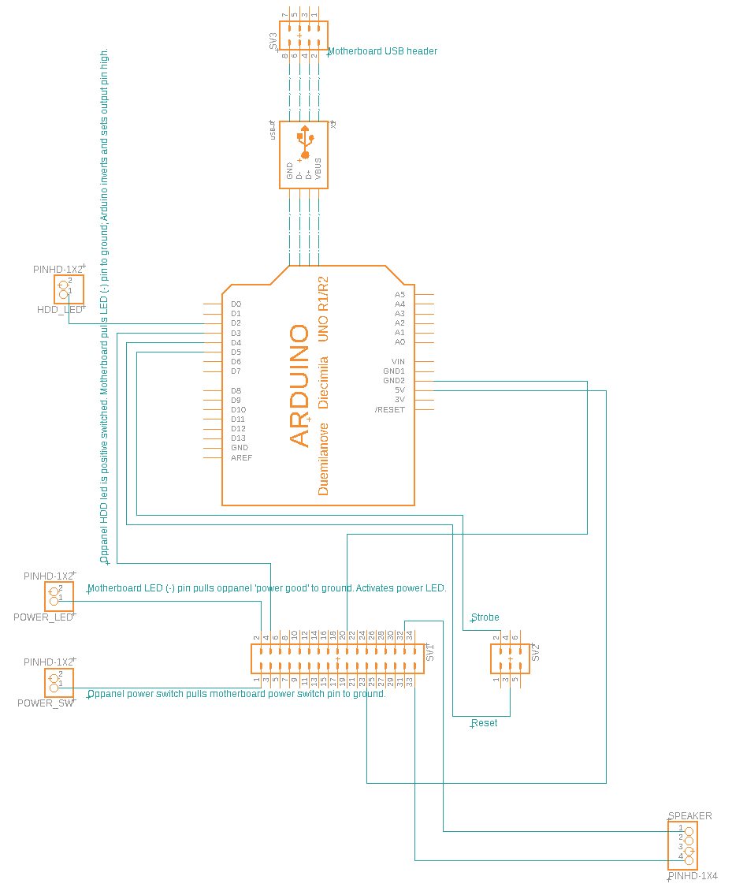

Interface IBM PS/2 Model 9595 operator panel over USB by means of an Arduino. Messages sent to the Arduino's serial port are shown on the display. CoreTemp plugin shows temperature, system speed and load.

[My IBM PS/2 Model 9595 case to ATX conversion project).](https://kentie.net/article/ps2atx2020)

Oppanel pins - (?) means I don't know what it's for:

Pin | Description                         | Pin | Description
----|-------------------------------------|-----|--------------
1   | On request (pulls to gnd)           | 18  | Ground
2   | Power good / LED (pull to gnd)      | 19  | (?)Address 1
3   | (?)Data 0                           | 20  | Ground
4   | HDD LED (pull to 5v)                | 21  | (?)Write LED (high) (pull to gnd)
5   | (?)Data 1                           | 22  | Ground
6   | (?)Unatteded (pull to gnd)          | 23  | (?)Write LED (low) (pull to gnd)
7   | (?)Data 2                           | 24  | Ground
8   | (?)Presence Detect 3                | 25  | 5v
9   | (?)Data 3                           | 26  | (?)Data 7
10  | (?)Presence Detect 2                | 27  | 5v
11  | (?)Data 4                           | 28  | Ground
12  | (?)Presence Detect 1                | 29  | (?)Remote power-on request (pull to gnd)
13  | (?)Data 5                           | 30  | (?)Read LED (pull to gnd)
14  | (?)Presence Detect 0                | 31  | 5v
15  | (?)Data 6                           | 32  | Speaker ground
16  | Ground                              | 33  | Speaker
17  | (?)Address 0                        | 34  | Speaker ground

[FindComPort.cpp](OpPanel/FindComPort.cpp) Contains code to open an USB (i.e. Arduino) COM port by device ID. This might be useful for other projects as well. The trick here is that the device is directly opened as a COM port, so there's no (dubious) code that tries to walk COM ports and match them to an Arduino by name or anything like that.
